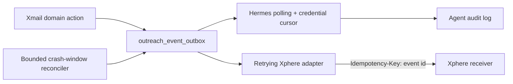

# Xmail outreach + Hermes architecture

## Security boundary

Hermes uses `X-Agent-Key` only against `/api/agent/outreach/*`. The clear token is returned once;
Xmail stores its SHA-256 hash, binds it to one organization and human principal, and evaluates an
explicit scope allow-list on every tool call. The existing `XMAIL_SERVICE_KEY` remains a legacy
Xphere credential and must never be shared with an LLM agent.

The initial Hermes capability set is deliberately asymmetric:

- read campaign state;
- import prospects in bounded batches;
- discover Apollo prospects without exposing provider secrets or consuming enrichment credits;
- rank persisted candidates with deterministic, explainable ICP scoring;
- create campaign drafts and sequence drafts;
- pause campaigns;
- poll and acknowledge durable events.

There is no agent endpoint to activate a campaign or dispatch mail. Human activation and every
send continue through the existing campaign validation, suppression, idempotency and dispatcher
policy gates.

> **Scope of this boundary (production reality, verified 2026-08-13).** Everything above
> describes the **Xmail agent gateway only**. In production Hermes also carries three other
> MCPs (`xphere`, `skaleclub`, `notion`) plus direct xcraper service credentials, and acts as
> the orchestrator of the whole prospecting pipeline (see `hermes/README.md`). In particular,
> Xphere's MCP tool `prospects_enroll_in_campaign` **can enroll prospects and activate an
> Xmail campaign** through Xphere's service-key path — its gate is a `confirmed:true`
> parameter granted after explicit human approval in chat (dry-run otherwise), not a missing
> capability. The invariant that holds across all paths is narrower than this document
> originally implied: Hermes never talks to SMTP or the dispatcher directly, and every send
> still passes Xmail's campaign validation, suppression and verification gates.

## Event flow



Producers commit `outreach.<event>` rows before returning. Hermes reads in `sequence_number` order
and advances only its own credential cursor after successful processing. Xphere has an independent
retry state with bounded exponential backoff, so either consumer may be unavailable without losing
the other consumer's progress.

Every event also has an organization-scoped deduplication key. A five-minute bounded reconciler
repairs the crash window where domain state committed immediately before an outbox insert failed;
its default lookback is six hours and can be changed with
`OUTREACH_EVENT_RECONCILE_LOOKBACK_HOURS`.

## API contract

| Method | Path | Scope | Effect |
|---|---|---|---|
| GET | `/health` | `outreach:read` | Connection and granted scopes |
| GET | `/campaigns` | `outreach:read` | Bounded organization campaign list |
| POST | `/prospects/import` | `prospects:write` | Idempotent batch import, maximum 100 |
| POST | `/prospecting/searches` | `prospects:search` | Idempotent Apollo discovery, maximum 100; no contact credits |
| GET | `/prospecting/searches/:id` | `outreach:read` | Run/provider/cost state |
| GET | `/prospecting/searches/:id/candidates` | `outreach:read` | Candidates ordered by explainable ICP score |
| POST | `/approvals/prospect-enrichment` | `prospects:enrich` | Request immutable candidate-set/credit approval, maximum 10 |
| GET | `/approvals/:id` | `approvals:read` | Poll an approval requested by this credential |
| POST | `/prospecting/searches/:id/enrich` | `prospects:enrich` | Execute only a matching, unexpired human approval |
| POST | `/prospecting/searches/:id/import` | `prospects:write` | Import score-qualified, verified-email candidates only |
| POST | `/campaigns/drafts` | `campaigns:draft` | Idempotent draft + canonical sequence only |
| POST | `/campaigns/:id/activation-requests` | `campaigns:request_activation` | Request human activation; never activates directly |
| POST | `/campaigns/:id/pause` | `campaigns:pause` | Immediate, idempotent pause |
| GET | `/events` | `events:read` | Ordered event polling |
| POST | `/events/ack` | `events:read` | Monotonic credential cursor |

All paths above are relative to `/api/agent/outreach`.
Campaign draft calls require a stable `idempotencyKey`; retrying the same key returns the original
draft instead of creating another campaign.

Apollo's key remains only in the Xmail server environment. Paid enrichment requires an immutable,
24-hour approval requested by the bound credential and reviewed in an interactive organization-admin
session. The approval records the candidate IDs and worst-case credit ceiling; execution atomically
consumes it once. Personal email and phone revelation remain disabled at the provider adapter.

## Operational rollout

1. Apply `supabase/migrations/045_outreach_agent_gateway.sql` and
   `supabase/migrations/046_prospecting_pipeline.sql`, then
   `supabase/migrations/047_outreach_action_approvals.sql`.
2. Deploy Xmail.
3. As an organization admin, create a credential through
   `POST /api/outreach/agent-credentials?organizationId=<uuid>` and retain the returned token.
4. Put the token in `/opt/hermes/hermes.env` as `XMAIL_AGENT_KEY` and recreate the Hermes container.
5. Register the mounted MCP server:

   ```bash
   docker exec -it hermes hermes mcp add xmail \
     --command node --args /opt/xmail-mcp/server.mjs
   ```

6. Verify `xmail_health`, import test prospects, create a draft, poll events and acknowledge the
   returned cursor. Revoke the credential immediately if it appears in logs or chat history.
